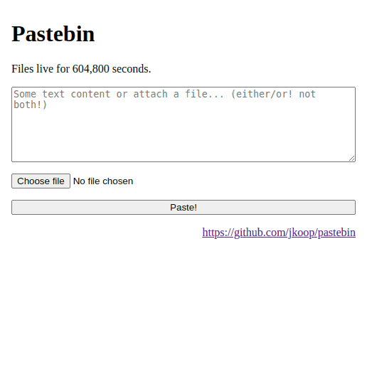

# Pastebin

This is my simple pastebin server.

Features:

- password for paster
- no password for readers
- no list of pastes
- short random path
- TODO: file deduplication on disk

## Install

1. clone the repo and `cd` into it
2. `cp docker-compose.override{-example,}.yml`
3. edit docker-compose.override.yml as desired
4. `mkdir data`
5. `chmod a+w data`
6. `docker compose up -d`
